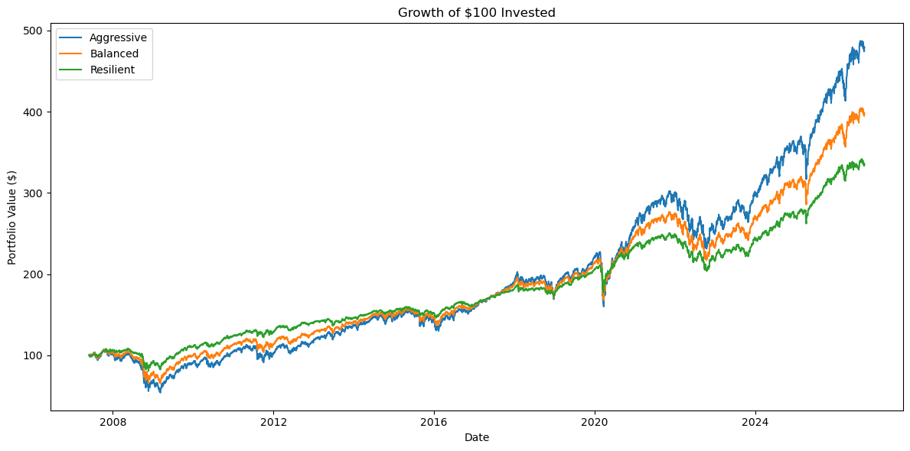
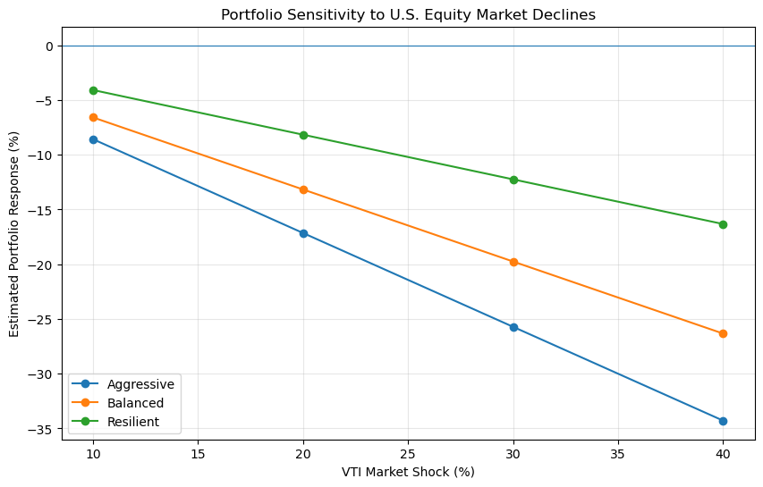

# Portfolio Risk & Stress-Testing Framework

An end-to-end market-risk framework built to apply quantitative techniques from Georgia State's QRAM (Quantitative Risk Analysis and Management) program to a real portfolio-management workflow — from data acquisition through historical backtesting, hypothetical stress testing, factor sensitivity, reverse stress testing, and portfolio-management decisions.

## The three portfolios

| Portfolio | Objective | Strategic Allocation (Equity / Bonds+Gold+Cash) |
|---|---|---|
| **Aggressive Growth** | Maximize long-term capital appreciation | 85% / 15% |
| **Balanced Growth** | Balance growth with downside protection | 65% / 35% |
| **Resilient Growth** | Emphasize downside protection while retaining growth exposure | 40% / 60% |

Full allocations, rationale, and implementation vehicles are in the [Portfolio Construction Report](documents/Portfolio_Construction_Report.pdf); the governing philosophy and risk framework are in the [Investment Policy Statement](documents/Investment_Policy_Statement.pdf).

## Headline results (2007–2026, ~19-year sample)

| Metric | Aggressive | Balanced | Resilient |
|---|---|---|---|
| Cumulative Return | 379.0% | 298.1% | 235.6% |
| Annualized Return | 8.47% | 7.43% | 6.48% |
| Annualized Volatility | 17.43% | 13.56% | 9.00% |
| Maximum Drawdown | -50.09% | -39.49% | -25.77% |
| Sharpe Ratio | 0.47 | 0.49 | **0.59** |

The highest historical return did not come with the highest risk-adjusted return. Once the full sample — including the 2008 financial crisis — is included, Resilient Growth produced the strongest return per unit of risk, not Aggressive.

## What the sensitivity analysis adds

Reducing equity exposure doesn't eliminate risk — it redistributes it. As allocations become more defensive, equity sensitivity drops, but interest-rate sensitivity rises with the larger bond allocation. That trade-off, and what to do about it, is the subject of the stress-testing and portfolio-evaluation notebooks below.

## The six-notebook pipeline

1. **[Market Data Acquisition & Preparation](notebooks/01-Market_Data_Acquisition_and_Preparation.ipynb)** — sourcing, cleaning, and validating 19 years of ETF price history, including handling two implementation ETFs with insufficient trading history via historical proxies.
2. **[Portfolio Construction](notebooks/02-Portfolio_Construction.ipynb)** — building the three strategic allocations and calculating daily portfolio returns.
3. **[Portfolio Risk & Performance Analysis](notebooks/03-Portfolio_Risk_and_Performance_Analysis.ipynb)** — cumulative/annualized return, volatility, max drawdown, VaR, Expected Shortfall, and Sharpe Ratio.
4. **[Historical Scenario Analysis](notebooks/04-Historical_Scenario_Analysis.ipynb)** — drawdown and recovery behavior across four historical crises, including the 2008 Global Financial Crisis and the 2020 COVID crash.
5. **[Portfolio Stress Testing & Risk Sensitivity Analysis](notebooks/05-Portfolio_Stress_Testing_and_Risk_Sensitivity_Analysis.ipynb)** — hypothetical stress scenarios, equity/interest-rate/multi-factor sensitivity with HAC-robust inference, and two-direction reverse stress testing.
6. **[Portfolio Evaluation, Rebalancing & Risk Management](notebooks/06-Portfolio_Evaluation_Rebalancing_and_Risk_Management.ipynb)** — synthesizes the above into a mandate-consistency review, a targeted allocation adjustment, a 5/25 tolerance-band rebalancing policy, and a final recommendation.

## Notes on methodology

- Two ETFs (VXUS, SGOV) lack sufficient trading history for the full sample and are proxied historically by VEU and BIL; the policy's actual implementation vehicles are unchanged. Details in Notebook 1 and the Portfolio Construction Report.
- The historical backtest uses constant target weights (equivalent to daily rebalancing) to isolate the effect of strategic allocation; Notebook 6 develops a more realistic quarterly tolerance-band policy separately.
- Sharpe Ratio uses BIL as a time-varying risk-free proxy rather than a fixed rate, so it reflects the actual rate environment across the sample rather than a single assumed value.

## Tools

Python (pandas, NumPy, statsmodels, Matplotlib), Jupyter, FRED and Yahoo Finance data.
